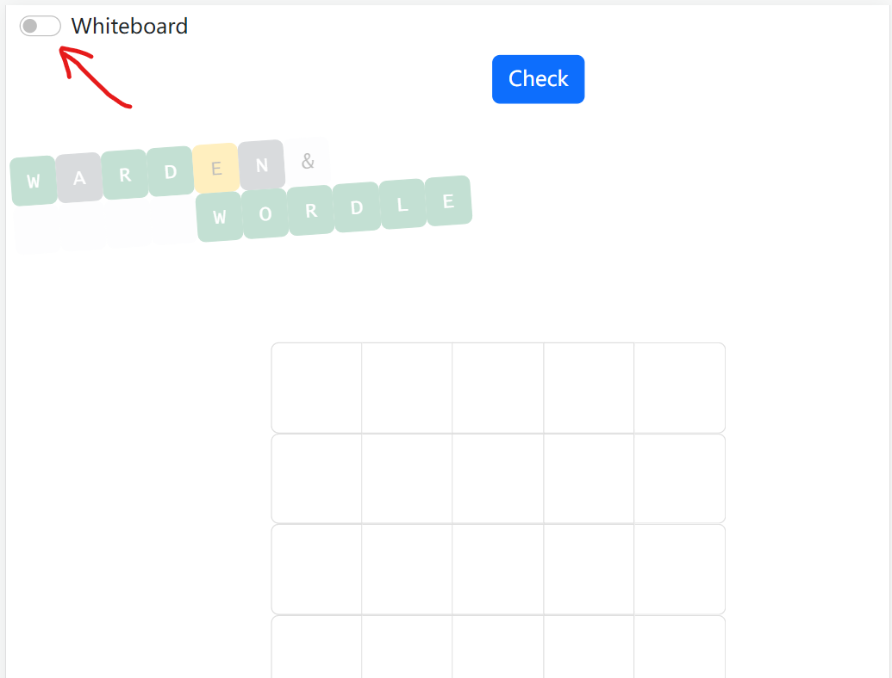
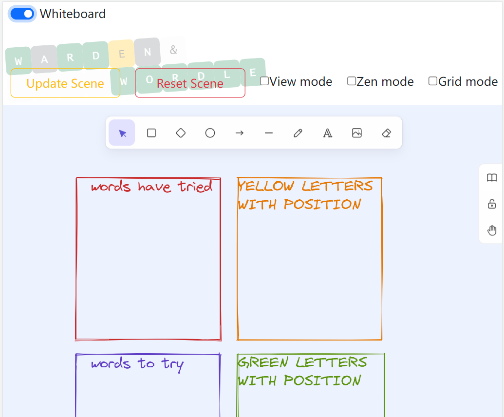
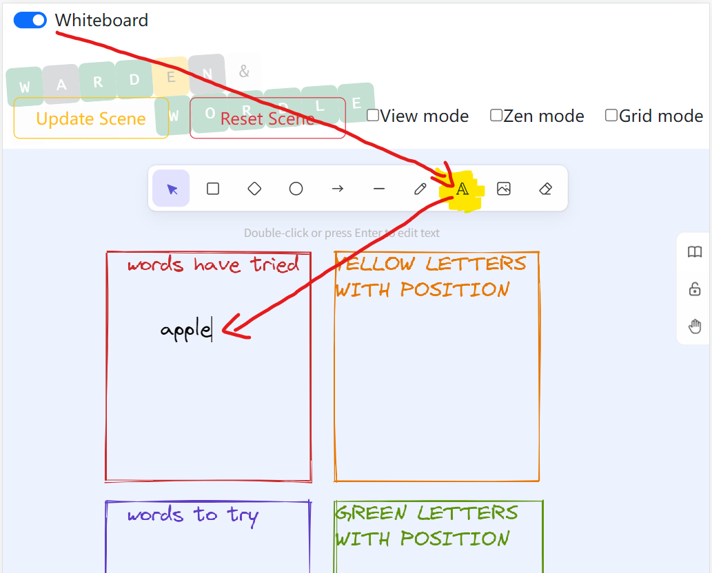
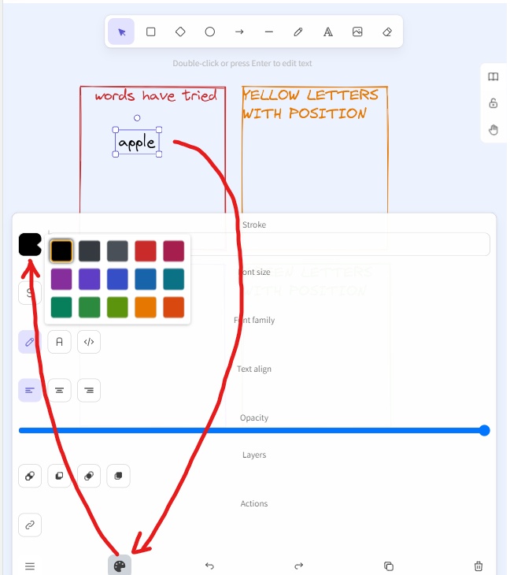
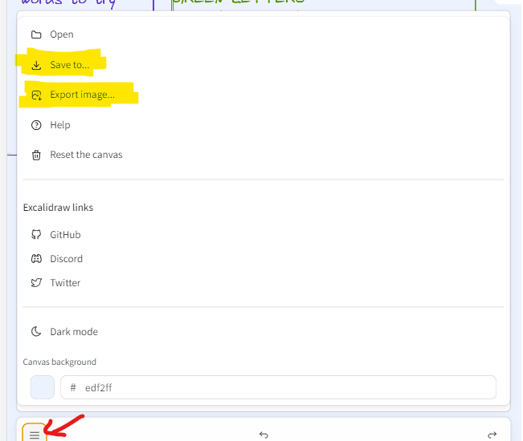
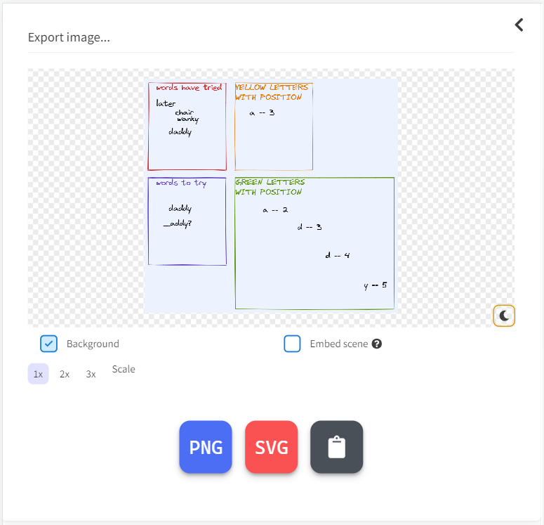

[![Contributors][contributors-shield]][contributors-url] [![Forks][forks-shield]][forks-url] [![Stargazers][stars-shield]][stars-url] [![Issues][issues-shield]][issues-url] [![MIT License][license-shield]][license-url]

<!-- PROJECT LOGO -->
 

  

<h3 align="center">Word game</h3>

This project was bootstrapped with [Create React App](https://github.com/facebook/create-react-app).

  

    A word game where you have to guess the five-letter word
     
    <a href="https://github.com/nrprabhav/game-player-project"><strong>Explore the docs »</strong></a>
     
     
    <a href="https://github.com/nrprabhav/game-player-project">View Demo</a>
    ·
    <a href="https://github.com/nrprabhav/game-player-project/issues">Report Bug</a>
    ·
    <a href="https://github.com/nrprabhav/game-player-project/issues">Request Feature</a>
  

<!-- TABLE OF CONTENTS -->

  
Table of Contents

  <ol>
    <li>
      <a href="#about-the-project">About The Project</a>
      <ul>
        <li><a href="#built-with">Built With</a></li>
      </ul>
    </li>
    <li><a href="#features-of-the-page">Features of the Page</a></li>
    <li><a href="#future-work">Future Work</a></li>
    <li><a href="#contributions">Contributions</a></li>
    <li><a href="#license">License</a></li>
    <li><a href="#contact">Contact</a></li>
    <li><a href="#acknowledgments">Acknowledgments</a></li>
  </ol>

<!-- ABOUT THE PROJECT -->
## About The Project

(insert gif of final app)

This app allows user to use the on screen keyboard to input their guesses for the correct word.

(<a href="#readme-top">back to top</a>)

### Built With

* [![Bootstrap][Bootstrap.com]][Bootstrap-url]
* [![JQuery][JQuery.com]][JQuery-url]

(<a href="#readme-top">back to top</a>)

<!-- Features of the Page -->
### Features of the Page
1. The app allows users to use an on screen keyboard to input letters to guess the correct word
2. There are animations and diffferent colours for the letters
3. A toggle button will show a whiteboard for users to write notes

<!-- USAGE EXAMPLES -->
## Usage

#### Homepage

#### Whiteboard

1. Use the toggle button on the left top to open it!
   
   or close it!
   
2. The initial area are divided into four areas. To add words on anywhere of the whiteboard, you could choose `letter button` in the top toolbar and tap anywhere you want on the whiteboard to insert a word or a piece of note. To delete the word, use the `eraser button` (You could erase any contents on the whiteboard, take care of that).
   
   To change color, tap the word then drag your screen down, all the attributes lie the bottom toolbar, try it!
   
   (If you find the bottom toolbar take up too much area of your whiteboard, click the &#9776; button to hide attributes setting.)
3. If you want to add more contents on the whiteboard, tap the `hand button` on the right toolbar, drag the whiteboard and add more notes on the spare space. Also, after moving to a spare space, the initial four areas could be adjusted when you tap on them.
4. Don't tap the `update scene` button and `reset scene` button on the top of whiteboard, or your notes will disappear. Before that, you should copy your whiteboard or save all the contents like this:
   
   For example, export the whiteboard as a png file:
   
5. Then you could try `update scene` button and `reset scene` button. I hide an egg there, which could help you work out wordle quickly!
6. Interest is the best teacher, there are more functions on the whiteboard you could try, like the `grid mode`. Go try it!
7. FAQ of whiteboard:
   * > Q: I am on my phone, and I opened the whiteboard, I would like to go back, but the screen cannot be dragged to the top?
   * A: Hold your finger on any one toolbar, then drag it! Yes, I mean the bottom toolbar, the right toolbar and the top toolbar!
   * > Q: I am on my phone, are the whiteboard contents also responsive on my small screen?
   * A: Whiteboard contents are not responsive, so you could use `hand button` on the right toolbar to drag your whiteboard, or check `view mode` on the top of whiteboard.
   * > Q: Zen mode? I don't think it is different with "normal mode".
   * A: Everyone has different state of mind, and "zen" also varies from people. Now zen mode is same as "normal" mode, and it is more or less a self-mesmerizing button. If you have some ideas about zen mode, contact us, issue or pull requests.

#### Completed game

(<a href="#readme-top">back to top</a>)

<!-- CONTRIBUTING -->
## Contributions

This website was developed by a team of developers as below

- [Bilaal Kulane](https://github.com/bilaalgithub)
  
- [Maisie Truong](https://github.com/mtruong1995)
  
- [Prabhav Reddy](https://github.com/nrprabhav)
 
- [Ranjana Kumar](https://github.com/kumarranjana)
  R
- [Weilong Wang](https://github.com/V7lanw)

(<a href="#readme-top">back to top</a>)

<!-- ROADMAP -->
## Future Work

- [ ] Polished UI:
      Improve design and animation
- [ ] Countdown timer
      Time limit to make it more advances
- [ ] Sound:
      Add sounds to the games to improve engagement
- [ ] Do extensive testing to locate bugs in the code

See the [open issues](https://github.com/nrprabhav/game-player-project/issues) for a full list of proposed features (and known issues).

(<a href="#readme-top">back to top</a>)

<!-- LICENSE -->
## License

Distributed under the MIT License. See `LICENSE.txt` for more information.

(<a href="#readme-top">back to top</a>)

<!-- CONTACT -->
## Links to the Project

Project Link: [https://github.com/nrprabhav/game-player-project](https://github.com/nrprabhav/game-player-project)

Deployed Link: [...](....)

(<a href="#readme-top">back to top</a>)

<!-- ACKNOWLEDGMENTS -->
## Acknowledgments

* Thanks to Drew Hoang and Austin Imbastari for teaching and supporting us.
* [Fantastic-pudding](https://fantastic-pudding.vercel.app/)
* [Bootstrap](https://getbootstrap.com/)

(<a href="#readme-top">back to top</a>)

<!-- MARKDOWN LINKS & IMAGES -->
<!-- https://www.markdownguide.org/basic-syntax/#reference-style-links -->
[contributors-shield]: https://img.shields.io/github/contributors/nrprabhav/Group-Project.svg?style=for-the-badge
[contributors-url]: https://github.com/nrprabhav/Group-Project/graphs/contributors
[forks-shield]: https://img.shields.io/github/forks/nrprabhav/Group-Project.svg?style=for-the-badge
[forks-url]: https://github.com/nrprabhav/Group-Project/network/members
[stars-shield]: https://img.shields.io/github/stars/nrprabhav/Group-Project.svg?style=for-the-badge
[stars-url]: https://github.com/nrprabhav/Group-Project/stargazers
[issues-shield]: https://img.shields.io/github/issues/nrprabhav/Group-Project.svg?style=for-the-badge
[issues-url]: https://github.com/nrprabhav/Group-Project/issues
[license-shield]: https://img.shields.io/github/license/nrprabhav/Group-Project.svg?style=for-the-badge
[license-url]: https://github.com/nrprabhav/Group-Project/blob/master/LICENSE.txt
[linkedin-shield]: https://img.shields.io/badge/-LinkedIn-black.svg?style=for-the-badge&logo=linkedin&colorB=555
[linkedin-url]: https://linkedin.com/in/linkedin_username
[product-screenshot]: ./assets/Times-table-game.gif
[Next.js]: https://img.shields.io/badge/next.js-000000?style=for-the-badge&logo=nextdotjs&logoColor=white
[Next-url]: https://nextjs.org/
[React.js]: https://img.shields.io/badge/React-20232A?style=for-the-badge&logo=react&logoColor=61DAFB
[React-url]: https://reactjs.org/
[Vue.js]: https://img.shields.io/badge/Vue.js-35495E?style=for-the-badge&logo=vuedotjs&logoColor=4FC08D
[Vue-url]: https://vuejs.org/
[Angular.io]: https://img.shields.io/badge/CSS3-DD0031?style=for-the-badge&logo=css3&logoColor=white
[Angular-url]: https://angular.io/
[youtube.dev]: https://img.shields.io/badge/Youtube-4A4A55?style=for-the-badge&logo=youtube&logoColor=FF3E00
[youtube-url]: https://youtube.com/
[GiPhy.com]: https://img.shields.io/badge/GIPHY-FF2D20?style=for-the-badge&logo=giphy&logoColor=white
[GiPhy-url]: https://giphy.com/
[Bootstrap.com]: https://img.shields.io/badge/Bootstrap-563D7C?style=for-the-badge&logo=bootstrap&logoColor=white
[Bootstrap-url]: https://getbootstrap.com
[JQuery.com]: https://img.shields.io/badge/jQuery-0769AD?style=for-the-badge&logo=jquery&logoColor=white
[JQuery-url]: https://jquery.com 
[canva.com]:https://img.shields.io/badge/Canva-%2300C4CC.svg?style=for-the-badge&logo=Canva&logoColor=white
[canva-url]: https://www.canva.com/