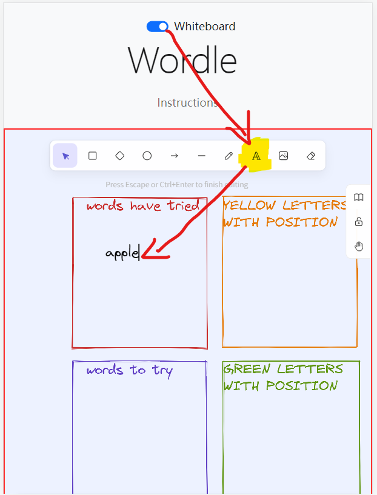

# Whiteboard

## Usage

1. Use the toggle button on the top to open or close it!
   
2. The initial area are divided into four areas. To add words on anywhere of the whiteboard, you could choose `letter button` in the top toolbar and tap anywhere you want on the whiteboard to insert a word or a piece of note. To delete the word, use the `eraser button` (You could erase any contents on the whiteboard, take care of that).
   

   To change color, tap the word then drag your screen down, all the attributes lie the bottom toolbar, try it!

   

   (If you find the bottom toolbar take up too much area of your whiteboard, click the &#9776; button to hide attributes setting.)
3. If you want to add more contents on the whiteboard, tap the `hand button` on the right toolbar, drag the whiteboard and add more notes on the spare space. Also, after moving to a spare space, the initial four areas could be adjusted when you tap on them.
4. You could copy your whiteboard or save all the contents like this:

   

   For example, export the whiteboard as a png file:

   
5. Interest is the best teacher, there are more functions on the whiteboard you could try, like the `grid mode`. Go try it!

## FAQ of whiteboard

* > Q: I am on my phone, and I opened the whiteboard, I would like to go back, but the screen cannot be dragged to the top?
* A: Hold your finger on any one toolbar, then drag it! Yes, I mean the bottom toolbar, the right toolbar and the top toolbar!
* > Q: I am on my phone, are the whiteboard contents also responsive on my small screen?
* A: Whiteboard contents are not responsive, so you could use `hand button` on the right toolbar to drag your whiteboard, or check `view mode` on the top of whiteboard.
* > Q: Zen mode? I don't think it is different with "normal mode".
* A: Everyone has different state of mind, and "zen" also varies from people. Now zen mode is same as "normal" mode, and it is more or less a self-mesmerizing button. If you have some ideas about zen mode, contact us, issue or pull requests.
